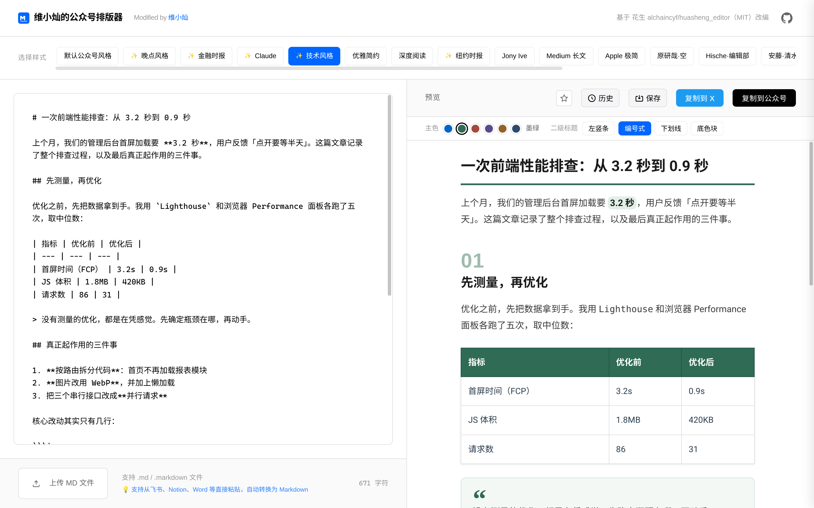

# 维小灿的公众号排版器

把 Markdown 一键排版成微信公众号富文本：左边写，右边实时预览，点「复制到公众号」直接粘进后台。

👉 在线使用：**<https://weixiaocan.github.io/huasheng_editor/>**



> 本项目基于 [花生 alchaincyf/huasheng_editor](https://github.com/alchaincyf/huasheng_editor)（MIT）改编。
> 感谢原作者开源了这么好用的编辑器，大部分功能都来自原项目。

## 我改了什么

写公众号时我一直用原版编辑器，用得最多的是「技术风格」，但有两个地方一直不顺手，于是 fork 过来按自己的需要改了改：

### 1. 修复左右滚动同步

原来编辑区和预览区的滚动会互相拉扯：滚轮一滚就被拽回去，拖滚动条会来回跳，边写边对照预览很难受。

- 两侧改为同一张「锚点对」映射表正反插值（textarea 用镜像元素测量真实换行位置），两个方向互为反函数，不再打架
- 只让用户正在操作的一侧驱动另一侧，程序触发的滚动一律不回传
- 预览重新渲染、图片加载、窗口尺寸变化后自动重新对齐，打字时预览不跳
- 滚动条加宽加深，更容易看见和拖动

### 2. 技术风格可以「每篇不一样」

原来的技术风格每篇文章都长一个样。现在选中技术风格后，预览上方会出现一条选择栏：

- **6 套主色**：经典蓝（默认，与原版一致）、墨绿、砖红、深紫、琥珀、藏青。标题、加粗、链接、引用、行内代码、分割线、表头都会跟着变，正文保持深灰
- **4 种二级标题**：左竖条（原版）、编号式（自动 01 / 02 / 03）、下划线、底色块
- **新的引用样式**：不再用左竖条（避免和二级标题撞车），改为浅底圆角 + 主色大引号「“」
- 选择会记在浏览器里，下次打开还是上次的搭配

所有装饰都写成内联样式和真实文本节点（不用 CSS 变量、伪元素、计数器），复制到公众号后样式照样保留。

### 3. 其他

- 去掉了原项目的推广位和统计代码，页面标识改为本 fork

## 原有功能（来自原项目）

- 20 种排版样式，可收藏常用样式
- 实时预览、一键复制到公众号 / X
- 智能粘贴：从飞书、Notion、Word 等直接粘贴，自动转成 Markdown
- 图片粘贴 / 拖拽，自动压缩并存入 IndexedDB，复制时转 Base64；多图自动网格排版
- 支持上传 .md / .markdown 文件，文章历史记录

## 技术要点

- 纯前端静态页面，无构建步骤：Vue 3 + markdown-it
- 所有样式最终转为内联样式，兼容公众号编辑器的过滤规则
- 部署在 GitHub Pages，推送到 `master` 即自动更新

## 本地运行

```bash
git clone https://github.com/weixiaocan/huasheng_editor.git
cd huasheng_editor
python3 -m http.server 8080
# 浏览器打开 http://localhost:8080
```

## 项目结构

```
├── index.html   # 页面结构与界面样式
├── app.js       # Vue 应用逻辑（渲染、滚动同步、复制等）
├── styles.js    # 排版主题（含技术风格的主色 / 二级标题变体）
├── vendor/      # Vue、markdown-it 等第三方库
└── assets/      # 截图等资源
```

## 开源协议与致谢

本项目沿用 [MIT License](LICENSE)，保留原作者版权声明：

- 原项目：[alchaincyf/huasheng_editor](https://github.com/alchaincyf/huasheng_editor)，作者 花生（alchaincyf）
- 本 fork 的修改：[维小灿（weixiaocan）](https://github.com/weixiaocan)
